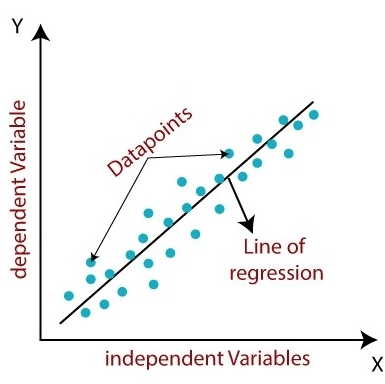
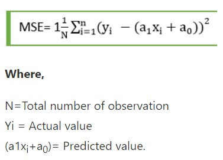
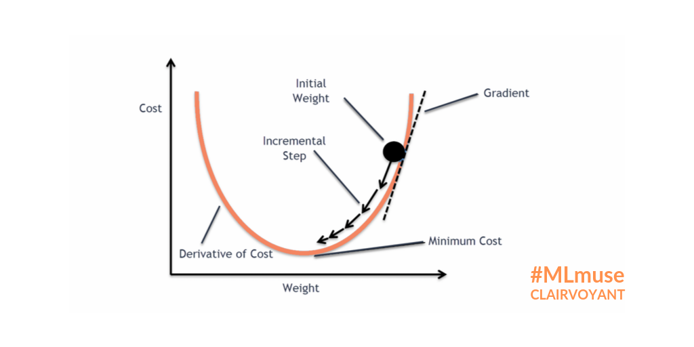
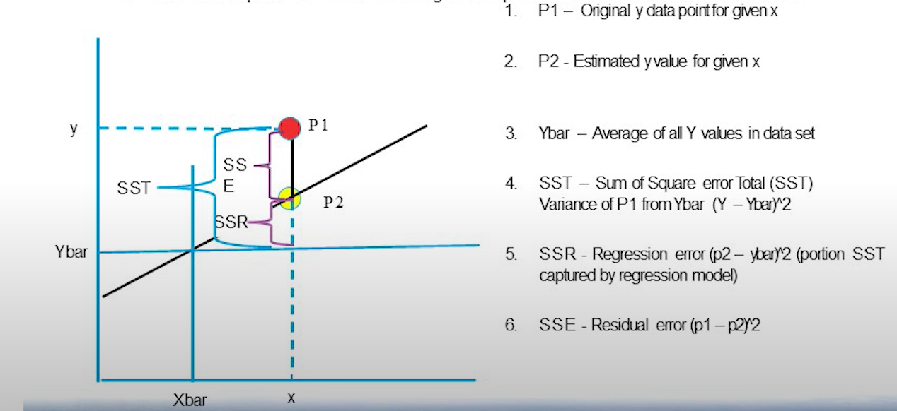

# <u><center>Linear Regression

**Linear** means straight, and **Regression** means finding relationship between ind and dep var

    
1. It's a statistical method used for predictive analysis. It's a supervised learning technique.
 
    
2. It predicts only continuous/real/numeric values(Eg: Sales,Salary,etc..). Example: Predicting the salary(y) of an employee given the years of exp(x).
 
    
3. It shows linear relationship between dep var(y) and one/more ind var(x1, x2.....), meaning, how y changes with change in x.
 
    
4. Graphically represented by straight line, and mathematically by equation - 
##### <center>target_or_ind_var(y) = intercept(a) + LR_coeff(a1) * ind_var_or_predictor(x1) + random_error(e)
    Here, <br>a1 is the slope/gradient of the line, and can be +ve/-ve/zero. <br> a is the intercept, and can be +ve/-ve/zero. <br> e is the random comp/error/residue/ or diff b/w actual and predicted tagret var
         


5. <u>**Types of Linear regression**</u>:
    - Simple/Univariate LR: Only one ind var exist. Relation b/w x and y can be shown by straight line(1D).
    - Multiple/Multivariate LR: Two(Bivariate)/more ind var exist. Relation b/w x and y can be shown by Plane(for 2D) or Hyperplane(for > 2D).

    
6. **LR line** shows two type of relationship b/w dep and ind var. If y increases as x increases then **Positive Linear Relationship**, and if y descreases as x increases then **Negative Linear Relationship**.

    
7. The purpose is to find the best fit line, meaning, the diff b/w the actual and predicted value should be minimized, and the regression line should have least error. To do that, we have weights/co-eff of the line(a and a1). So, we need to find the best co-eff of line by experimenting with diff values. To get the best co-eff, we use **cost function.**

    
8. <u>**Cost funtion**</u>:
    - It optimises the regression co-eff
    - It measures the performance of LR model
    - It is used to find accuracy of the Mapping/Hyothesis function(equation b/w y and x)
    - For LR, we use **Mean square error(MSE)** as cost function.
    - MSE - It's the avg of diff b/w the actual and predicted values.
    


9. <u>**Residual**</u>: The diff between the actual and predicted values. If the points in the scatter plot are far from regression line then high residual, and vice versa.


10. So here, we have to find out the best co-eff, also means, iterating over diff value of weights to minimize the MSE/Cost function or in other words to reduce the residuals. To do this, we use **Gradient descent method**.


11. <u>**Gradient descent(GD)**</u>: 
     - Main function is to update the co-eff of the line, and minimize the Cost function/MSE/Residuals. 
     - So mathematically, it's a minimization problem, meaning, we have to reach some minimum point of the function, also called convergence. 
     - It starts by randomly selecting the values of weights/co-eff, and iteratively reaching the point where the MSE is least, basically finding the minima of the cost function.
     - In GD algo, the speed of reaching the minima point is dependent on Hyperparameter called learning rate(alpha), which means, the number of steps you take for each iteration. It means, changing one weight/co-eff of the line, and keeping other constant. And for each iteration, we calculate MSE. It will go on until we find the best value of co-eff or least value of MSE.
     - Here we take partial derivatives(also called gradient) of each weights, and keep updating the values as per the learning rate.
     - If we select the optimum value of learning rate, then our GD algo will converge in less no. of iterations. So here learning rate defines the performance of GD algo.
     - GD uses partial derivatives to calculate least MSE. Partial derivaties means, how MSE changes with small change in any one dim(a or a0, that's why partial) at a time. If MSE decreases(Descent) with increase in coeff a, then move in that direction, and vice versa.
     - Importance of normalization of data: Feature value should be in certain range(-1 to 1) to speed up the execution of gradient descent algo, in other terms, std dev should not be high.
     - Why Bowl shape graph? Because Cost function in LR is quadratic equation(MSE has square term in equation), and by property of QE, when it is plotted on the graph with diff values of var, it's always convex/parabolic shape(Bowl shape) and they bound to have one minima.
     - Learning step/rate decreases as we progress towards our objective(Here, Global minima), so that we don't miss and oscillate across minima. This algo is called Bold Driver algo(Type of GD).


12. **<u>Model performance**</u>:
    - MSE - Mean square error or in simple terms variance(how data points are spread across best fit line)
    - RMSE - Root MSE, it gives the avg error our model makes.
    - R-squared method: Statistical method used to find the godness of fit.
    - Values raging from 0-100
    - Higher the R-square value, stronger is the relation b/w y and x, better the model.
    - Also called, coefficient of determination.
    - D - Learn more about R-squared

13. <u>**Assumptions**</u>:
    - Linear relationship b/w y and x, meaning, y should be directly or inversely porpotional to each other, in other terms relation between these two var can be shown by a stragiht line.
    - Small or no multicollinearity b/w ind var, meaning, there should not be any corellation b/w ind vars. In other words, ind var are ind of each other, they don't influence each other, they only influence targer var(y). This is just an assumption because in real world it doesn't exist. We can measure how 2 ind var are corelated to each other by using co-eff of correlation(r), which ranges from -1(highly negatively correlated) to 1(highly positively correlated). If they are highly correlated, then we use the technique - **Dimension reductionality**, meaning, creating one synthetic dim from 2 highly correlated ind dims, without dropping any.
    - Homogeneity of variance or Homoscedasticity: The error term doesn't change much or is constant as the value of ind var changes, meaning, same scatter around the BFL, which also means equal variance. Also, there should not be any trend in error terms.
    - The error(actual - predicted value) terms must be normally distributed.
    - No corellation in error terms with ind and dep var. If we observe scatter plot of error vs ind/dep var, we should not see any trend/relation, it should be a random apperance.
    - Each observation/row should be ind of each other
    
    
14. <u>**Advantages**</u>:
    - Good performace for linearly seperable data
    - Easy to implement. 
    - Easy to interpret(White box model). I can say how much y changes by change in 1 unit of x, generally called slope/co-eff/weight.
    - Efficient to train with Big data as well(Scalability)
    - It handles overfitting well using Dimension reduction tech, Regularization, and Cross val(CV)
    
    
15. <u>**Disadvantages**</u>:
    - Sensitive to outliers
    - Prone to multicollinearity
    - Prone to noise and overfit.
    - Assumes linear relationship b/w x and y, meaning, straight line relationship.
    - Assumes ind var are not related.

# <u>Preprocessing

1. Exclude features which has very less unique values, meaning, not a good ind var, also called low variance filter. For eg: Gender(M or F), because if M was deciding something then the target value would have same value for all the M.


2. Encoding:
    - Most ML algo work with numeric data only(few may work with category data like Decision tree) 
    - If we want to encode string with numeric value, then we should do encoding. 
    - If the var is not ordinal variable(which have some order), Label/integer encoding is done, for eg: Temp col has 3 values - low, medium and high. These values can be mapped to int values - 1, 2, 3, here ML algo interpret this as 1>2>3, means, it has some order, which is true in temperature case. 
    - If the var don't have any order then we need to use **one hot encoding**, for eg: Category column gender(M or F) can be encoded in 2 diff binary/dummy var, col1 - Male(1 or 0) ,and col2 - Female(1 or 0).

## Implementation of Simple LR


```python
# import some required libraries
import matplotlib.pyplot as plt
import pandas as pd
import numpy as np

# Define dataset. Salary = y and exp = x
experience = np.array([2.4,5.0,1.5,3.8,8.7,3.6,1.2,8.1,2.5,5,1.6,1.6,2.4,3.9,5.4])
salary = np.array([2.1,4.7,1.7,3.6,8.7,3.2,1.0,8.0,2.4,6,1.1,1.3,2.4,3.9,4.8])
n = np.size(experience)

# Plot the data points
plt.scatter(experience,salary, color = 'red')
plt.xlabel("Experience")
plt.ylabel("Salary")
plt.show()
```


    

    


```python
# Initialize the parameters
a0 = 0                  # intercept
a1 = 0                  # Slope
lr = 0.0001             # Learning rate
iterations = 1000       # Number of iterations
error = []              # Error array to calculate cost for each iterations.
for itr in range(iterations):
    error_cost = 0
    cost_a0 = 0
    cost_a1 = 0
    for i in range(len(experience)):
        y_pred = a0+a1*experience[i]   # predict value for given x
        error_cost = error_cost +(salary[i]-y_pred)**2
        for j in range(len(experience)):
            partial_wrt_a0 = -2 *(salary[j] - (a0 + a1*experience[j]))                #partial derivative w.r.t a0
            partial_wrt_a1 = (-2*experience[j])*(salary[j]-(a0 + a1*experience[j]))   #partial derivative w.r.t a1
            cost_a0 = cost_a0 + partial_wrt_a0      #calculate cost for each number and add
            cost_a1 = cost_a1 + partial_wrt_a1      #calculate cost for each number and add
        a0 = a0 - lr * cost_a0    #update a0
        a1 = a1 - lr * cost_a1    #update a1
        #print(itr,a0,a1)          #Check iteration and updated a0 and a1
    error.append(error_cost)      #Append the data in array
```


```python
# Plot the error for each iteration
plt.figure(figsize=(10,5))
plt.plot(np.arange(1,len(error)+1),error,color='red',linewidth = 5)
plt.title("Iteration vr error")
plt.xlabel("iterations")
plt.ylabel("Error")
```


    Text(0, 0.5, 'Error')


    

    


```python
# Optimum/best weights/co-eff
print(a0, a1)
```

    -0.21354150071690242 1.0247464287610857
    


```python
# Predict the salary by using optimum co-eff/weights of the best fit regression line
pred = a0 + a1*experience
print(pred)
```

    [2.24584993 4.91019064 1.32357814 3.68049493 8.70175243 3.47554564
     1.01615421 8.08690457 2.34832457 4.91019064 1.42605279 1.42605279
     2.24584993 3.78296957 5.32008921]
    


```python
# Plot the regression line.
plt.scatter(experience,salary,color = 'red')
plt.plot(experience,pred, color = 'green')
plt.xlabel("experience")
plt.ylabel("salary")
```


    Text(0, 0.5, 'salary')


    

    


```python
# Calculate the MSE
error1 = salary - pred
se = np.sum(error1 ** 2)
mse = se/n
print("mean squared error is", mse)
```

    mean squared error is 0.12785817711928918
    

## Implementation of LR using Sklearn package


```python
# Use the scikit library to confirm the above steps.
from sklearn.linear_model import LinearRegression
from sklearn.metrics import mean_squared_error 

experience = experience.reshape(-1,1)

model = LinearRegression()
model.fit(experience,salary)

salary_pred = model.predict(experience)

Mse = mean_squared_error(salary, salary_pred)

print('slope', model.coef_)
print("Intercept", model.intercept_)
print("MSE", Mse)
```

    slope [1.02474643]
    Intercept -0.2135415007169028
    MSE 0.1278581771192891
    

## Summary
1. In Regression, we plot a graph between the variables which best fit the given data points. 
2. Linear regression shows the linear relationship between the independent variable (X-axis) and the dependent variable (Y-axis).
3. To calculate best-fit line linear regression uses a traditional slope-intercept form. A regression line can be a Positive Linear Relationship or a Negative Linear Relationship.
4. The goal of the linear regression algorithm is to get the best values for a0 and a1 to find the best fit line and the best fit line should have the least error. 
5. In Linear Regression, Mean Squared Error (MSE) cost function is used, which helps to figure out the best possible values for a0 and a1, which provides the best fit line for the data points. 
6. Using the MSE function, we will change the values of a0 and a1 such that the MSE value settles at the minima. Gradient descent is a method of updating a0 and a1 to minimize the cost function (MSE)

## Great learning notes on LR
1. Models are Lines/surfaces/planes/Hyperplane(we don't know how it looks) in feature space(means, dep and ind vars).


2. a and a1 are the coeff of the model, and it forms the relation b/w x and y. Here weights(a1, a2....) are nothing but, how much y changes by changing 1 unit of x, by keeping every other ind var constant and so on and so forth for x2, x3....


3. Linear means, model represented by linear combination of ind vars/explanatory vars, meaning, where one or more ind var is scaled by a factor and added together.


4. No. of dim in model = No. of dim in feature space - 1


5. Ind var should be strongly related(either +ve and -ve) to y, in other words we can say it's a strong predictor of y. If it weakly correlated, then we simply drop that ind var from the model.


6. If ind var are not linearly related to y, then we can use non-linear model in the case.


7. For Linear model, scaling has no impact. Scaling is req only if the Linear model uses GD for optimization, because diff var has diff range, and GD uses learning rate, meaning step size, and we should ensure that the step size is same for all the features. So, when we scale the features, all will come in a range, say 0 to 1(min-max scaling or normalization, value-min/max-min), and GD moves somoothly(and converge quickly) to the global minima as the step size is same for all the features.


8. The BFL always passes through the mean of ind and dep vars. If the mean of var is not reliable, then the model will also be not reliable.

9. Errors/Variance:
    - SSE/Residual errors =(Actual - Predicted)^2   . So GD tries to minimize this error only.
    - SSR/Regressor error = (Predicted - Expected(mean))^2   . It's because of the natural process. Indeterministic in nature, we don't know why it happens.
    - SST/Total error = SSR + SSE.
    - Most fit line is where SSE = 0. In that case, SSR = SST, which also means SSR/SST = 1. We can say Model performance is good as SSE = 0 and SSR/SST = 1. So, this ratio measures the goodness of fit, also called coeff of determination(R-square). Poor fit means large SSE, which means, SSR/SST close to 0. So, it ranges b/w 0(poor fit) and 1(good fit).
    


10. **R-square**: 
    - How much of the total variance in our dep var(y) our model is able to explain is measured by R-square. 
    - For eg: R-square = 0.7, meaning, our LR model is able to explain 70% variance in the y, in other words, 70% of variance in y is predicted from ind vars. 
    - If R-square value is close to 0, then y values are far from BFL, and if close to 1, then near to BFL.
    - R-square works for Simple LR but fails for Mutliple LR. 
    - Formula: R^2 = 1 - (SSE/SSR), so for BFL SSE is small term and SSR is large, so the second term in the equation is small value. Hence, R-square will be closer to 1, mostly in case of univariate. But in multivariate, we use **Adjusted R-square**.
    
    
11. **Adjusted R-square**:
    - R-square increases if we increase the number of ind var, even if the var is insignificant.
    - To avoid that, we have adjusted R-square(modified equation), which works well in case of multiple regression.
    - If useless ind var are included, then R-square will increase but Adj R-sq will decrease. Hence more reliable metric.

# <u>Scaling<u>

1. Impact on scaling on diff ML algos -
    - <u>GD based algo</u>: Different var has diff range, and GD uses learning rate, meaning step size, and we should ensure that the step size is same for all the features. So, when we scale the features, all will come in a range, say 0 to 1(min-max scaling or normalization, value-min/max-min), and GD moves somoothly(and converge quickly) to the global minima as the step size is same for all the features.
    - <u>Distance based algo</u>: For eg, we have 2 feature - CGPA(0 to 10) and Salary(3 lakh to 20 lakh). ML algo gives more imp to the feature which has higher magnitude, to avoid that, we scale data and bring to a certain range.
    - <u>Tree based algo</u>: Invariant to scaling because splitting happens on single featrue to increase the homogeniity of node, so split on feature is not influenced by other feature.
2. KA - https://www.analyticsvidhya.com/blog/2020/04/feature-scaling-machine-learning-normalization-standardization/

# <u>Outliers<u>

1. In LR, the BFL gets pulled towards the outlier, and we may not get the best co-eff of equation in that case, so we need to handle ourliers in LR.

# <u>Statistics<u>

1. **Mean**: Represents whole population by a single value. For eg: If we want to order T-shirt for students in a class, it's convinient to give one number to tailor, we think of mean/avg size of the student. But how is this mean reliable? It is reliable if the **variance** is less, it's not if variance is very high. Many times we have seen an equation uses one value for the poplulation i.e. mean. Variance measures the spread of points in dataset.


2. **Covariance**: Ind var should not have any covariance withing themselves, but ind var should have strong covariance with dep var. It measures directional relationship b/w two var. If it's +ve, then 2 vars are directly propotional and vice versa.


3. **Coeff of correlation or Person's correlation(r):** It measures strength of relationship b/w 2 vars. 
    - r = 1, +ve linear correlation, at least > 0.7 , if not, further research is req.
    - r = -1, -ve linear correlation, at least < -0.7, if not, further research is req.
    - r = 0, no linear correlation(but can have other relation), it will never happen in real world. 
    - Ind var should have strong correlation(GOOD PREDICTOR) with dep var, and no correlation with other ind vars.
    
    
4. For a given value of x, if we have 2 diff val of y, then it's called **Stochastic variance or noise**(type of variance), and we don't know the reason behine the noise, whereas, if we know the reason it's called **Deterministic variance**(type of variance), which produces same output to same set of inputs all the time. However, stochastic models are opp, there will be noise/randomness/unpredictability in data.

# <u>**Notes**<u>

1. Brute Force Algo:
    - Trying out all the possible ways to solve a given problem, and find the best solution. For eg: Travelling salesman problem(TSP), we need to visit 10 cities, Brute force will calculate all the possible distances to the 10 cities and select the least one. But this may not be the efficient way to solve the problem.
    - Time complexity of BF algo is O(n*m)
    - Slow, inefficient and relies more on computing power of system instead of good algo design.
