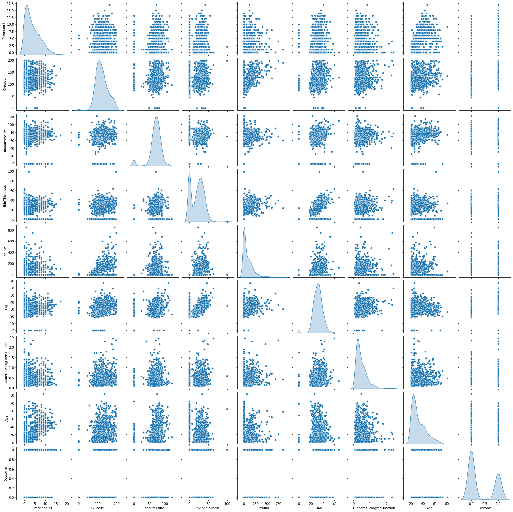
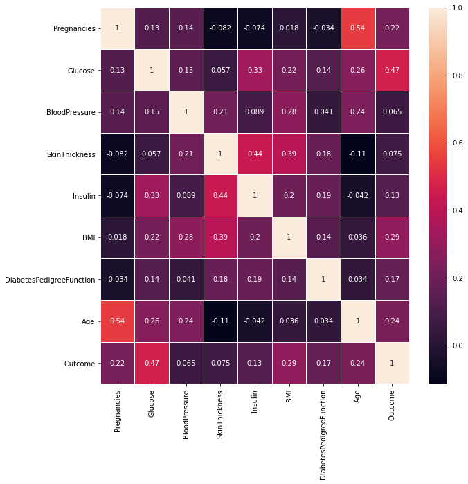
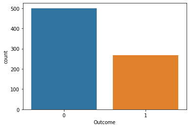
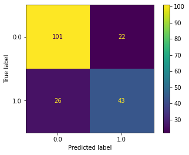
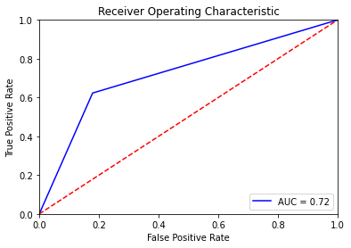

# <center><u>Logistic Regression</u>

**Logsitic** word is because of logit function and **Regression** because under the hood we have LR.

**Supervised | Uses the concept of LR(Straight line equation, but modified to give results b/w 0 and 1) | Mostly used for Binary classification | Predict categorical/discrete values | Solves classification problems | Gives probabilistic value b/w 0 & 1 | Fit S shaped logistic/Sigmoid function which maps predicted value to probabalities(0 to 1) | To classify, we need to set some threshold | Types of Log reg - 1. Binomial/Multinomial(Dep var has unordered 2 or more values) 2. Ordinal(Dep var has 3 or more ordered values, for eg, low, medium, high)**

# Important pointers
1. BFL to sigmoid curve(S shape), where BFL can go from -inf to +inf but sigmoid can go from 0 to 1.
2. For multiclass, multiple S curve cut each other, each curve gives prob of one class(One vs rest - OVR)
3. Linear model is passed to the logistic function [ y = 1/(1+e^-x) ], result of which ranges from 0 to 1(also denoted as p). We should decide the cut-off/threshold.
4. Log loss/binary cross-entropy is the cost function, lower the better. README - [link]( https://www.analyticsvidhya.com/blog/2020/11/binary-cross-entropy-aka-log-loss-the-cost-function-used-in-logistic-regression/)
5. Since sigmoid function is non linear, so MSE can't be used as cost function because it's difficult to get global minima by GD in non-linear case.
6. Outlier has to be addressed because it's linear model. More the outlier, more the log loss.
7. Adv: Multiclass | also gived prob of each class | One of the best algo | quick to learn | Fast | White box | resitance to overfit | Interpret model coeff as feature importane.|
8. Disadv: Data dist should be linearly separable because it contructs linear boundaries.
9. L1 and L2 regularization technique can be used if overfit
10. README - [link](https://www.analyticsvidhya.com/blog/2021/10/building-an-end-to-end-logistic-regression-model/)

### Import Packages


```python
import pandas as pd
import numpy as np
import seaborn as sns
import matplotlib.pyplot as plt
%matplotlib inline
from sklearn.model_selection import train_test_split
from sklearn.linear_model import LogisticRegression
from sklearn.preprocessing import StandardScaler
from sklearn.metrics import plot_confusion_matrix
from sklearn.metrics import accuracy_score
from sklearn.metrics import roc_auc_score 
from sklearn.metrics import roc_curve
from sklearn.metrics import classification_report
import warnings
warnings.simplefilter('ignore')

# Remove max col display limit
pd.options.display.max_columns = None
# Print all cols in single line
pd.options.display.width=None
```

### Read CSV file


```python
df = pd.read_csv("diabetes.csv")
display(df.head())
```


<div>
<style scoped>
    .dataframe tbody tr th:only-of-type {
        vertical-align: middle;
    }

    .dataframe tbody tr th {
        vertical-align: top;
    }

    .dataframe thead th {
        text-align: right;
    }
</style>
<table border="1" class="dataframe">
  <thead>
    <tr style="text-align: right;">
      <th></th>
      <th>Pregnancies</th>
      <th>Glucose</th>
      <th>BloodPressure</th>
      <th>SkinThickness</th>
      <th>Insulin</th>
      <th>BMI</th>
      <th>DiabetesPedigreeFunction</th>
      <th>Age</th>
      <th>Outcome</th>
    </tr>
  </thead>
  <tbody>
    <tr>
      <th>0</th>
      <td>6</td>
      <td>148</td>
      <td>72</td>
      <td>35</td>
      <td>0</td>
      <td>33.6</td>
      <td>0.627</td>
      <td>50</td>
      <td>1</td>
    </tr>
    <tr>
      <th>1</th>
      <td>1</td>
      <td>85</td>
      <td>66</td>
      <td>29</td>
      <td>0</td>
      <td>26.6</td>
      <td>0.351</td>
      <td>31</td>
      <td>0</td>
    </tr>
    <tr>
      <th>2</th>
      <td>8</td>
      <td>183</td>
      <td>64</td>
      <td>0</td>
      <td>0</td>
      <td>23.3</td>
      <td>0.672</td>
      <td>32</td>
      <td>1</td>
    </tr>
    <tr>
      <th>3</th>
      <td>1</td>
      <td>89</td>
      <td>66</td>
      <td>23</td>
      <td>94</td>
      <td>28.1</td>
      <td>0.167</td>
      <td>21</td>
      <td>0</td>
    </tr>
    <tr>
      <th>4</th>
      <td>0</td>
      <td>137</td>
      <td>40</td>
      <td>35</td>
      <td>168</td>
      <td>43.1</td>
      <td>2.288</td>
      <td>33</td>
      <td>1</td>
    </tr>
  </tbody>
</table>
</div>


### Desciptive statistics of all the numeric columns


```python
display(df.describe().transpose())
```


<div>
<style scoped>
    .dataframe tbody tr th:only-of-type {
        vertical-align: middle;
    }

    .dataframe tbody tr th {
        vertical-align: top;
    }

    .dataframe thead th {
        text-align: right;
    }
</style>
<table border="1" class="dataframe">
  <thead>
    <tr style="text-align: right;">
      <th></th>
      <th>count</th>
      <th>mean</th>
      <th>std</th>
      <th>min</th>
      <th>25%</th>
      <th>50%</th>
      <th>75%</th>
      <th>max</th>
    </tr>
  </thead>
  <tbody>
    <tr>
      <th>Pregnancies</th>
      <td>768.0</td>
      <td>3.845052</td>
      <td>3.369578</td>
      <td>0.000</td>
      <td>1.00000</td>
      <td>3.0000</td>
      <td>6.00000</td>
      <td>17.00</td>
    </tr>
    <tr>
      <th>Glucose</th>
      <td>768.0</td>
      <td>120.894531</td>
      <td>31.972618</td>
      <td>0.000</td>
      <td>99.00000</td>
      <td>117.0000</td>
      <td>140.25000</td>
      <td>199.00</td>
    </tr>
    <tr>
      <th>BloodPressure</th>
      <td>768.0</td>
      <td>69.105469</td>
      <td>19.355807</td>
      <td>0.000</td>
      <td>62.00000</td>
      <td>72.0000</td>
      <td>80.00000</td>
      <td>122.00</td>
    </tr>
    <tr>
      <th>SkinThickness</th>
      <td>768.0</td>
      <td>20.536458</td>
      <td>15.952218</td>
      <td>0.000</td>
      <td>0.00000</td>
      <td>23.0000</td>
      <td>32.00000</td>
      <td>99.00</td>
    </tr>
    <tr>
      <th>Insulin</th>
      <td>768.0</td>
      <td>79.799479</td>
      <td>115.244002</td>
      <td>0.000</td>
      <td>0.00000</td>
      <td>30.5000</td>
      <td>127.25000</td>
      <td>846.00</td>
    </tr>
    <tr>
      <th>BMI</th>
      <td>768.0</td>
      <td>31.992578</td>
      <td>7.884160</td>
      <td>0.000</td>
      <td>27.30000</td>
      <td>32.0000</td>
      <td>36.60000</td>
      <td>67.10</td>
    </tr>
    <tr>
      <th>DiabetesPedigreeFunction</th>
      <td>768.0</td>
      <td>0.471876</td>
      <td>0.331329</td>
      <td>0.078</td>
      <td>0.24375</td>
      <td>0.3725</td>
      <td>0.62625</td>
      <td>2.42</td>
    </tr>
    <tr>
      <th>Age</th>
      <td>768.0</td>
      <td>33.240885</td>
      <td>11.760232</td>
      <td>21.000</td>
      <td>24.00000</td>
      <td>29.0000</td>
      <td>41.00000</td>
      <td>81.00</td>
    </tr>
    <tr>
      <th>Outcome</th>
      <td>768.0</td>
      <td>0.348958</td>
      <td>0.476951</td>
      <td>0.000</td>
      <td>0.00000</td>
      <td>0.0000</td>
      <td>1.00000</td>
      <td>1.00</td>
    </tr>
  </tbody>
</table>
</div>


### Check for missing values, datatypes of cols, memory, and NULL values


```python
display(df.info())
```

    <class 'pandas.core.frame.DataFrame'>
    RangeIndex: 768 entries, 0 to 767
    Data columns (total 9 columns):
     #   Column                    Non-Null Count  Dtype  
    ---  ------                    --------------  -----  
     0   Pregnancies               768 non-null    int64  
     1   Glucose                   768 non-null    int64  
     2   BloodPressure             768 non-null    int64  
     3   SkinThickness             768 non-null    int64  
     4   Insulin                   768 non-null    int64  
     5   BMI                       768 non-null    float64
     6   DiabetesPedigreeFunction  768 non-null    float64
     7   Age                       768 non-null    int64  
     8   Outcome                   768 non-null    int64  
    dtypes: float64(2), int64(7)
    memory usage: 54.1 KB
    


    None


### Pairplot to see the Distribution of all the vars, and scatter plot b/w 2 var


```python
sns.pairplot(df, diag_kind = "kde")         # Kernel density estimate
```


    <seaborn.axisgrid.PairGrid at 0x139f91f34f0>


    

    


### Pearson coeff of correlation


```python
corr = df.corr(method="pearson")
corr
```


<div>
<style scoped>
    .dataframe tbody tr th:only-of-type {
        vertical-align: middle;
    }

    .dataframe tbody tr th {
        vertical-align: top;
    }

    .dataframe thead th {
        text-align: right;
    }
</style>
<table border="1" class="dataframe">
  <thead>
    <tr style="text-align: right;">
      <th></th>
      <th>Pregnancies</th>
      <th>Glucose</th>
      <th>BloodPressure</th>
      <th>SkinThickness</th>
      <th>Insulin</th>
      <th>BMI</th>
      <th>DiabetesPedigreeFunction</th>
      <th>Age</th>
      <th>Outcome</th>
    </tr>
  </thead>
  <tbody>
    <tr>
      <th>Pregnancies</th>
      <td>1.000000</td>
      <td>0.129459</td>
      <td>0.141282</td>
      <td>-0.081672</td>
      <td>-0.073535</td>
      <td>0.017683</td>
      <td>-0.033523</td>
      <td>0.544341</td>
      <td>0.221898</td>
    </tr>
    <tr>
      <th>Glucose</th>
      <td>0.129459</td>
      <td>1.000000</td>
      <td>0.152590</td>
      <td>0.057328</td>
      <td>0.331357</td>
      <td>0.221071</td>
      <td>0.137337</td>
      <td>0.263514</td>
      <td>0.466581</td>
    </tr>
    <tr>
      <th>BloodPressure</th>
      <td>0.141282</td>
      <td>0.152590</td>
      <td>1.000000</td>
      <td>0.207371</td>
      <td>0.088933</td>
      <td>0.281805</td>
      <td>0.041265</td>
      <td>0.239528</td>
      <td>0.065068</td>
    </tr>
    <tr>
      <th>SkinThickness</th>
      <td>-0.081672</td>
      <td>0.057328</td>
      <td>0.207371</td>
      <td>1.000000</td>
      <td>0.436783</td>
      <td>0.392573</td>
      <td>0.183928</td>
      <td>-0.113970</td>
      <td>0.074752</td>
    </tr>
    <tr>
      <th>Insulin</th>
      <td>-0.073535</td>
      <td>0.331357</td>
      <td>0.088933</td>
      <td>0.436783</td>
      <td>1.000000</td>
      <td>0.197859</td>
      <td>0.185071</td>
      <td>-0.042163</td>
      <td>0.130548</td>
    </tr>
    <tr>
      <th>BMI</th>
      <td>0.017683</td>
      <td>0.221071</td>
      <td>0.281805</td>
      <td>0.392573</td>
      <td>0.197859</td>
      <td>1.000000</td>
      <td>0.140647</td>
      <td>0.036242</td>
      <td>0.292695</td>
    </tr>
    <tr>
      <th>DiabetesPedigreeFunction</th>
      <td>-0.033523</td>
      <td>0.137337</td>
      <td>0.041265</td>
      <td>0.183928</td>
      <td>0.185071</td>
      <td>0.140647</td>
      <td>1.000000</td>
      <td>0.033561</td>
      <td>0.173844</td>
    </tr>
    <tr>
      <th>Age</th>
      <td>0.544341</td>
      <td>0.263514</td>
      <td>0.239528</td>
      <td>-0.113970</td>
      <td>-0.042163</td>
      <td>0.036242</td>
      <td>0.033561</td>
      <td>1.000000</td>
      <td>0.238356</td>
    </tr>
    <tr>
      <th>Outcome</th>
      <td>0.221898</td>
      <td>0.466581</td>
      <td>0.065068</td>
      <td>0.074752</td>
      <td>0.130548</td>
      <td>0.292695</td>
      <td>0.173844</td>
      <td>0.238356</td>
      <td>1.000000</td>
    </tr>
  </tbody>
</table>
</div>


### Heatmap for coeff of correlation


```python
fig, ax = plt.subplots(figsize=(10,10))  
sns.heatmap(corr, annot = True, xticklabels= corr.columns, yticklabels= corr.columns, linewidths= 1, ax=ax)
```


    <AxesSubplot:>


    

    


### Check if the target column is balanced or not


```python
sns.countplot(data = df, x = "Outcome")
```


    <AxesSubplot:xlabel='Outcome', ylabel='count'>


    

    


## Implement Logistic Regression using Sklearn package


```python
# Conver to numpy arrays
np_array = df.values
X = np_array[:,0:7]
Y = np_array[:,8]

# Any number in random state is fine, signifies, whenever we run the code, train and test data should be same.
x_train, x_test, y_train, y_test = train_test_split(X, Y, test_size=0.25, random_state=42)

# Create object and train the model
log_reg = LogisticRegression()
log_reg.fit(x_train, y_train)

# Predict the class
y_predict = log_reg.predict(x_test)
```

### Confusion matrix
   - TP, TN, FP/Type 1 error, and FN/Type 2 error
   - Accuracy: TP + TN / no. of rows
       + Not a good metric in case of imbalanced target class
   - Precision: TP / ( TP + FP )        
       + Used when FP is of higher concern, for eg, recommendation engine, suggesting irrelevant content to user
   - Recall: TP / ( TP + FN )
       + Used when FN is more concerned, for eg, medical case, predicting negative result for infected person
   - Combine both - F1 score: 
      + Harmonic mean of Precision and recall. F1-score = 2 * P * R / (P + R) 
      + Less interpretability, can't rely because it won't say which one is better, precision or recall? So, always use with other metrics.


```python
plot_confusion_matrix(log_reg, x_test, y_test)  
plt.show()
```


    

    


### Accuracy and AUC of Model


```python
accuracy = accuracy_score(y_true=y_test, y_pred=y_predict)
print("Model accuracy is: {}".format(accuracy))
roc_auc = roc_auc_score(y_test, y_predict)
print("AUC-ROC score is: {}".format(roc_auc))
```

    Model accuracy is: 0.75
    AUC-ROC score is: 0.7221633085896076
    

### Plot ROC-AUC curve
   - Probability curve and AUC represent measure of separability(how well model dintinguish b/w classes). Higher the AUC, better the model
   - TPR/Recall/Sensitivity: TP / ( TP + FN )
   - FPR: FP / ( FP + TN ). Also,  1 - Specificity 
   - AUC: 1 - Best | 0 - worst, Predicting opp classes | 0.5 - No class separation capacity
   - Specificity: TN / ( TN + FP ).
   - When AUC = 0.72(threshold as 0.5), meaning, 72% chance that the model will be able to predict correct class.
   - Sensitivity and Specificity are inversely propotional because when we increase threshold, TP increases and vice versa.
   - For multiclass, we plot AUC of One vs rest(OVR)
   - README - [Link](https://towardsdatascience.com/understanding-auc-roc-curve-68b2303cc9c5)


```python
fpr, tpr, threshold = roc_curve(y_test, y_predict)
plt.title('Receiver Operating Characteristic')
plt.plot(fpr, tpr, 'b', label = 'AUC = %0.2f' % roc_auc)
plt.legend(loc = 'lower right')
plt.plot([0, 1], [0, 1],'r--')
plt.xlim([0, 1])
plt.ylim([0, 1])
plt.ylabel('True Positive Rate')
plt.xlabel('False Positive Rate')
plt.show()
```


    

    


### Summary of Classification report


```python
print(classification_report(y_true=y_test, y_pred=y_predict))
```

                  precision    recall  f1-score   support
    
             0.0       0.80      0.82      0.81       123
             1.0       0.66      0.62      0.64        69
    
        accuracy                           0.75       192
       macro avg       0.73      0.72      0.72       192
    weighted avg       0.75      0.75      0.75       192
    
    
